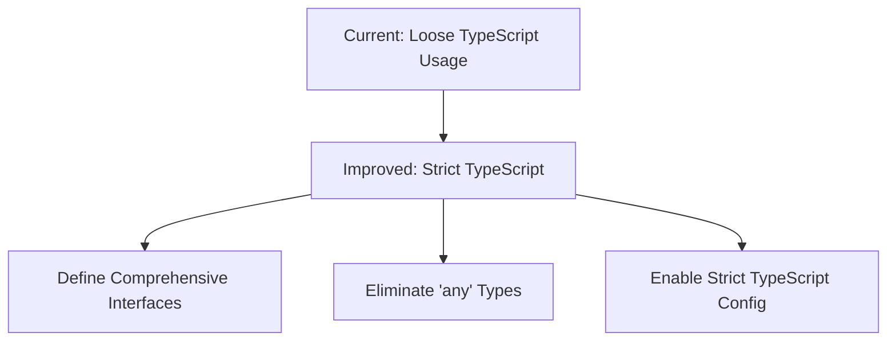
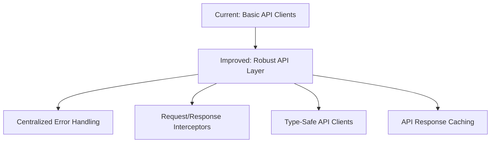
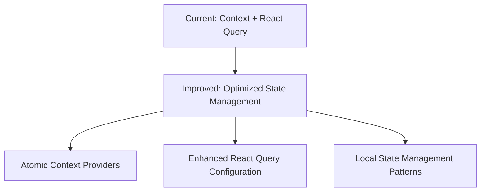
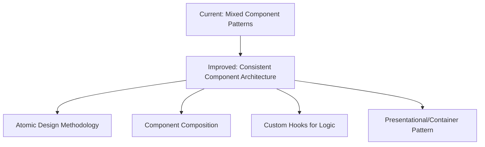
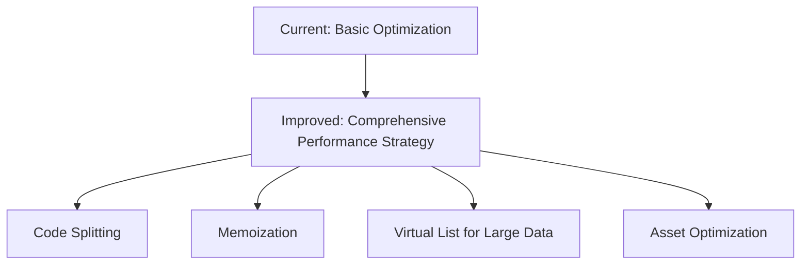

# Architectural Improvement Plan for Concert Journal App

## Current Architecture Overview

The Concert Journal App is a React application built with TypeScript that allows users to track and manage concert experiences. The application follows a client-server architecture with:

- **Frontend**: React application with Material UI components
- **Backend**: Separate API service accessed via HTTP
- **Authentication**: JWT-based authentication with refresh tokens
- **State Management**: React Context for global state, React Query for server state
- **Routing**: React Router for navigation
- **Styling**: Material UI components
- **Build Tool**: Vite
- **Deployment**: Docker containers orchestrated with Docker Compose

## Strengths of Current Architecture

1. **Modern Tech Stack**: Uses React 18, TypeScript, Vite, and Material UI 7
2. **Component Organization**: Components are logically grouped by feature
3. **State Management**: Appropriate use of React Context for global state and React Query for server state
4. **Authentication**: Implements secure token-based authentication with refresh tokens
5. **Responsive Design**: Different UI layouts for mobile and desktop
6. **External API Integration**: Integration with MusicBrainz API for band information

## Areas for Improvement

Based on the analysis of the codebase, the following areas could be improved to better align with best practices:

1. **Type Safety**: Many components use `any` types instead of proper TypeScript interfaces
2. **API Layer**: Basic API clients without comprehensive error handling or type safety
3. **State Management**: Context providers could be more atomic and focused
4. **Component Architecture**: Mixed component patterns and prop drilling in some areas
5. **Performance**: Limited use of memoization and code splitting
6. **Testing**: Basic testing setup without comprehensive strategy
7. **Security**: Basic security measures that could be enhanced
8. **DevOps**: Basic Docker setup without CI/CD pipeline
9. **Documentation**: Limited code and architecture documentation
## Detailed Improvement Recommendations

### 1. Enhanced Type Safety



**Recommendations:**

- Enable strict TypeScript configuration in `tsconfig.json`:

```json
{
  "compilerOptions": {
    "strict": true,
    "noImplicitAny": true,
    "strictNullChecks": true,
    "strictFunctionTypes": true,
    "strictBindCallApply": true,
    "strictPropertyInitialization": true,
    "noImplicitThis": true,
    "alwaysStrict": true
  }
}
```

- Create a dedicated `types` directory for shared type definitions:

```
src/
├── types/
│   ├── api.ts
│   ├── auth.ts
│   ├── events.ts
│   └── ui.ts
```

- Replace all `any` types with proper interfaces, especially in API responses and component props:

```typescript
// Before
interface UseEvents {
    data: any;
    error: any;
    isLoading: boolean;
    refetch: () => void;
    createEvent: (
        data: { /* event data */ },
        options?: {
            onSuccess?: (data: any) => void;
            onError?: (error: any) => void;
        }
    ) => Promise<void>;
}

// After
interface Event {
    id: number;
    bandName: string;
    place: string;
    date: string;
    comment: string;
    rating: number;
    appUser: {
        firstName: string;
        lastName: string;
        username: string;
    };
}

interface ApiError {
    message: string;
    statusCode: number;
    details?: Record<string, string>;
}

interface UseEvents {
    data: Event[] | undefined;
    error: ApiError | null;
    isLoading: boolean;
    refetch: () => void;
    createEvent: (
        data: Omit<Event, 'id' | 'appUser'>,
        options?: {
            onSuccess?: (data: Event) => void;
            onError?: (error: ApiError) => void;
        }
    ) => Promise<void>;
}
```
### 2. API Layer Redesign



**Recommendations:**

- Create a centralized API error handling utility:

```typescript
// src/api/apiErrors.ts
export enum ApiErrorType {
  NETWORK_ERROR = 'NETWORK_ERROR',
  UNAUTHORIZED = 'UNAUTHORIZED',
  FORBIDDEN = 'FORBIDDEN',
  NOT_FOUND = 'NOT_FOUND',
  VALIDATION_ERROR = 'VALIDATION_ERROR',
  SERVER_ERROR = 'SERVER_ERROR',
  UNKNOWN_ERROR = 'UNKNOWN_ERROR'
}

export interface ApiError {
  type: ApiErrorType;
  message: string;
  statusCode?: number;
  details?: Record<string, string>;
  originalError?: unknown;
}

export function handleApiError(error: unknown): ApiError {
  if (axios.isAxiosError(error)) {
    if (!error.response) {
      return {
        type: ApiErrorType.NETWORK_ERROR,
        message: 'Network error. Please check your connection.',
        originalError: error
      };
    }

    const statusCode = error.response.status;
    const responseData = error.response.data;

    switch (statusCode) {
      case 401:
        return {
          type: ApiErrorType.UNAUTHORIZED,
          message: 'Unauthorized. Please log in again.',
          statusCode,
          originalError: error
        };
      case 403:
        return {
          type: ApiErrorType.FORBIDDEN,
          message: 'You do not have permission to perform this action.',
          statusCode,
          originalError: error
        };
      case 404:
        return {
          type: ApiErrorType.NOT_FOUND,
          message: 'The requested resource was not found.',
          statusCode,
          originalError: error
        };
      case 422:
        return {
          type: ApiErrorType.VALIDATION_ERROR,
          message: 'Validation error. Please check your input.',
          statusCode,
          details: responseData.errors,
          originalError: error
        };
      case 500:
      case 502:
      case 503:
      case 504:
        return {
          type: ApiErrorType.SERVER_ERROR,
          message: 'Server error. Please try again later.',
          statusCode,
          originalError: error
        };
      default:
        return {
          type: ApiErrorType.UNKNOWN_ERROR,
          message: `Error: ${responseData.message || 'Unknown error'}`,
          statusCode,
          originalError: error
        };
    }
  }

  return {
    type: ApiErrorType.UNKNOWN_ERROR,
    message: error instanceof Error ? error.message : 'Unknown error occurred',
    originalError: error
  };
}
```

- Enhance the API client with proper interceptors:

```typescript
// src/api/apiClient.tsx
import axios, { AxiosInstance, AxiosRequestConfig, AxiosResponse } from 'axios';
import { useContext, useMemo } from 'react';
import { ConfigContext } from '../contexts/ConfigContext';
import { handleApiError } from './apiErrors';

const useApiClient = () => {
  const config = useContext(ConfigContext);
  const API_URL = config?.backendURL ?? 'http://localhost:8080';

  return useMemo(() => {
    const apiClient = axios.create({
      baseURL: API_URL,
      withCredentials: true,
      timeout: 10000, // 10 seconds timeout
    });

    // Request interceptor
    apiClient.interceptors.request.use(
      (config) => {
        // Add logging in development
        if (process.env.NODE_ENV === 'development') {
          console.log(`API Request: ${config.method?.toUpperCase()} ${config.url}`);
        }
        return config;
      },
      (error) => {
        return Promise.reject(handleApiError(error));
      }
    );

    // Response interceptor
    apiClient.interceptors.response.use(
      (response) => {
        // Add logging in development
        if (process.env.NODE_ENV === 'development') {
          console.log(`API Response: ${response.status} ${response.config.url}`);
        }
        return response;
      },
      (error) => {
        const processedError = handleApiError(error);
        
        // Log errors in development
        if (process.env.NODE_ENV === 'development') {
          console.error('API Error:', processedError);
        }
        
        return Promise.reject(processedError);
      }
    );

    return { apiClient };
  }, [API_URL]);
};

export default useApiClient;
```

- Create type-safe API functions:

```typescript
// src/api/apiEvents.tsx
import { AxiosResponse } from 'axios';
import useApiClient from './apiClient';
import { Event, CreateEventData, UpdateEventData } from '../types/events';

const EventsApi = () => {
  const { apiClient } = useApiClient();

  const getAllEvents = async (token: string): Promise<Event[]> => {
    const response: AxiosResponse<Event[]> = await apiClient.get('/allEvents', {
      headers: {
        'Authorization': `Bearer ${token}`,
      },
    });
    return response.data;
  };

  const createEvent = async (data: CreateEventData, token: string): Promise<Event> => {
    const response: AxiosResponse<Event> = await apiClient.post('/event', data, {
      headers: {
        'Authorization': `Bearer ${token}`,
        'Content-Type': 'application/json'
      },
    });
    return response.data;
  };

  const updateEvent = async (id: number, data: UpdateEventData, token: string): Promise<Event> => {
    const response: AxiosResponse<Event> = await apiClient.put(`/event/${id}`, data, {
      headers: {
        'Authorization': `Bearer ${token}`,
        'Content-Type': 'application/json'
      },
    });
    return response.data;
  };

  const deleteEvent = async (id: number, token: string): Promise<void> => {
    await apiClient.delete(`/event/${id}`, {
      headers: {
        'Authorization': `Bearer ${token}`,
        'Content-Type': 'application/json'
      },
    });
  };

  return { getAllEvents, createEvent, updateEvent, deleteEvent };
};

export default EventsApi;
### 3. State Management Optimization



**Recommendations:**

- Split the AuthContext into smaller, more focused contexts:

```typescript
// src/contexts/AuthStateContext.tsx
import React, { createContext, useState, useContext } from 'react';

interface AuthStateContextType {
  isLoggedIn: boolean;
  setIsLoggedIn: (isLoggedIn: boolean) => void;
  isLoading: boolean;
  setIsLoading: (isLoading: boolean) => void;
}

const AuthStateContext = createContext<AuthStateContextType | null>(null);

export const AuthStateProvider: React.FC<React.PropsWithChildren> = ({ children }) => {
  const [isLoggedIn, setIsLoggedIn] = useState(false);
  const [isLoading, setIsLoading] = useState(true);

  return (
    <AuthStateContext.Provider value={{
      isLoggedIn,
      setIsLoggedIn,
      isLoading,
      setIsLoading
    }}>
      {children}
    </AuthStateContext.Provider>
  );
};

export const useAuthState = () => {
  const context = useContext(AuthStateContext);
  if (!context) {
    throw new Error('useAuthState must be used within an AuthStateProvider');
  }
  return context;
};

// src/contexts/TokenContext.tsx
import React, { createContext, useState, useContext } from 'react';

interface TokenContextType {
  token: string;
  setAccessToken: (token: string) => void;
  csrfToken: string;
  setCsrfToken: (token: string) => void;
}

const TokenContext = createContext<TokenContextType | null>(null);

export const TokenProvider: React.FC<React.PropsWithChildren> = ({ children }) => {
  const [token, setAccessToken] = useState<string>('');
  const [csrfToken, setCsrfToken] = useState('');

  return (
    <TokenContext.Provider value={{
      token,
      setAccessToken,
      csrfToken,
      setCsrfToken
    }}>
      {children}
    </TokenContext.Provider>
  );
};

export const useToken = () => {
  const context = useContext(TokenContext);
  if (!context) {
    throw new Error('useToken must be used within a TokenProvider');
  }
  return context;
};
```

- Configure React Query with global defaults:

```typescript
// src/lib/queryClient.ts
import { QueryClient } from 'react-query';
import { ApiErrorType } from '../api/apiErrors';

export const queryClient = new QueryClient({
  defaultOptions: {
    queries: {
      staleTime: 5 * 60 * 1000, // 5 minutes
      cacheTime: 30 * 60 * 1000, // 30 minutes
      retry: (failureCount, error: any) => {
        // Don't retry on certain error types
        if (
          error.type === ApiErrorType.UNAUTHORIZED ||
          error.type === ApiErrorType.FORBIDDEN ||
          error.type === ApiErrorType.VALIDATION_ERROR
        ) {
          return false;
        }
        return failureCount < 3;
      },
      refetchOnWindowFocus: false,
      onError: (error: any) => {
        // Global error handling for queries
        if (error.type === ApiErrorType.UNAUTHORIZED) {
          // Handle unauthorized errors (e.g., redirect to login)
        }
      }
    },
    mutations: {
      retry: (failureCount, error: any) => {
        // Don't retry on certain error types
        if (
          error.type === ApiErrorType.UNAUTHORIZED ||
          error.type === ApiErrorType.FORBIDDEN ||
          error.type === ApiErrorType.VALIDATION_ERROR
        ) {
          return false;
        }
        return failureCount < 2;
      },
      onError: (error: any) => {
        // Global error handling for mutations
      }
    }
  }
});
```

- Implement custom hooks for form state management:

```typescript
// src/hooks/useForm.ts
import { useState, useCallback } from 'react';

interface FormOptions<T> {
  initialValues: T;
  onSubmit: (values: T) => void | Promise<void>;
  validate?: (values: T) => Record<string, string> | null;
}

export function useForm<T extends Record<string, any>>({
  initialValues,
  onSubmit,
  validate
}: FormOptions<T>) {
  const [values, setValues] = useState<T>(initialValues);
  const [errors, setErrors] = useState<Record<string, string>>({});
  const [isSubmitting, setIsSubmitting] = useState(false);

  const handleChange = useCallback((name: keyof T, value: any) => {
    setValues(prev => ({ ...prev, [name]: value }));
    
    // Clear error when field is changed
    if (errors[name as string]) {
      setErrors(prev => {
        const newErrors = { ...prev };
        delete newErrors[name as string];
        return newErrors;
      });
    }
  }, [errors]);

  const handleSubmit = useCallback(async (e?: React.FormEvent) => {
    if (e) {
      e.preventDefault();
    }

    if (validate) {
      const validationErrors = validate(values);
      if (validationErrors) {
        setErrors(validationErrors);
        return;
      }
    }

    setIsSubmitting(true);
    try {
      await onSubmit(values);
    } finally {
      setIsSubmitting(false);
    }
  }, [values, validate, onSubmit]);

  const reset = useCallback(() => {
    setValues(initialValues);
    setErrors({});
  }, [initialValues]);

  return {
    values,
    errors,
    isSubmitting,
    handleChange,
    handleSubmit,
    reset,
    setValues
  };
}
```
```
### 4. Component Architecture Refinement



**Recommendations:**

- Adopt Atomic Design principles with a new directory structure:

```
src/
├── components/
│   ├── atoms/
│   │   ├── Button/
│   │   ├── Input/
│   │   ├── Rating/
│   │   └── Typography/
│   ├── molecules/
│   │   ├── FormField/
│   │   ├── RatingWithLabel/
│   │   └── SearchInput/
│   ├── organisms/
│   │   ├── EntryForm/
│   │   ├── EventCard/
│   │   └── Navbar/
│   ├── templates/
│   │   ├── AuthLayout/
│   │   ├── DefaultLayout/
│   │   └── FormLayout/
│   └── pages/
│       ├── Journal/
│       ├── NewEntry/
│       └── SignIn/
```

- Implement the presentational/container pattern:

```typescript
// src/components/organisms/EntryForm/EntryFormView.tsx (Presentational)
import React from 'react';
import { TextField, Rating, Button, Alert } from '@mui/material';
import { DatePicker } from '@mui/x-date-pickers';
import dayjs from 'dayjs';

interface EntryFormViewProps {
  bandName: string;
  onBandNameChange: (value: string) => void;
  place: string;
  onPlaceChange: (value: string) => void;
  date: dayjs.Dayjs;
  onDateChange: (value: dayjs.Dayjs | null) => void;
  rating: number;
  onRatingChange: (value: number | null) => void;
  comment: string;
  onCommentChange: (value: string) => void;
  onSubmit: () => void;
  onCancel: () => void;
  isSubmitting: boolean;
  error: string | null;
  success: string | null;
  isUpdate: boolean;
}

const EntryFormView: React.FC<EntryFormViewProps> = ({
  bandName,
  onBandNameChange,
  place,
  onPlaceChange,
  date,
  onDateChange,
  rating,
  onRatingChange,
  comment,
  onCommentChange,
  onSubmit,
  onCancel,
  isSubmitting,
  error,
  success,
  isUpdate
}) => {
  return (
    <div>
      <TextField
        label="Band"
        value={bandName}
        onChange={(e) => onBandNameChange(e.target.value)}
        fullWidth
        margin="normal"
      />
      
      <TextField
        label="Place"
        value={place}
        onChange={(e) => onPlaceChange(e.target.value)}
        fullWidth
        margin="normal"
      />
      
      <div style={{ margin: '16px 0' }}>
        <Rating
          value={rating}
          onChange={(_, value) => onRatingChange(value)}
        />
      </div>
      
      <TextField
        label="Comment"
        value={comment}
        onChange={(e) => onCommentChange(e.target.value)}
        fullWidth
        multiline
        rows={4}
        margin="normal"
      />
      
      <DatePicker
        label="Date"
        value={date}
        onChange={onDateChange}
        sx={{ width: '100%', marginY: 2 }}
      />
      
      <div style={{ display: 'flex', gap: '16px', marginTop: '16px' }}>
        <Button
          variant="contained"
          color="primary"
          onClick={onSubmit}
          disabled={isSubmitting}
          fullWidth
        >
          {isUpdate ? 'Update Entry' : 'Create Entry'}
        </Button>
        
        <Button
          variant="outlined"
          onClick={onCancel}
          disabled={isSubmitting}
          fullWidth
        >
          Cancel
        </Button>
      </div>
      
      {error && (
        <Alert severity="error" sx={{ marginTop: 2 }}>
          {error}
        </Alert>
      )}
      
      {success && (
        <Alert severity="success" sx={{ marginTop: 2 }}>
          {success}
        </Alert>
      )}
    </div>
  );
};

export default EntryFormView;

// src/components/organisms/EntryForm/EntryFormContainer.tsx (Container)
import React, { useState } from 'react';
import { useNavigate } from 'react-router-dom';
import dayjs from 'dayjs';
import EntryFormView from './EntryFormView';
import { useForm } from '../../../hooks/useForm';
import useEvents from '../../../hooks/useEvents';

interface EntryFormContainerProps {
  initialValues?: {
    id?: number;
    bandName: string;
    place: string;
    date: dayjs.Dayjs;
    rating: number;
    comment: string;
  };
  isUpdate?: boolean;
}

const EntryFormContainer: React.FC<EntryFormContainerProps> = ({
  initialValues = {
    bandName: '',
    place: '',
    date: dayjs(),
    rating: 0,
    comment: ''
  },
  isUpdate = false
}) => {
  const navigate = useNavigate();
  const { createEvent, updateEvent } = useEvents();
  const [error, setError] = useState<string | null>(null);
  const [success, setSuccess] = useState<string | null>(null);
  
  const { values, handleChange, handleSubmit, isSubmitting } = useForm({
    initialValues,
    validate: (values) => {
      const errors: Record<string, string> = {};
      if (!values.bandName.trim()) {
        errors.bandName = 'Band name is required';
      }
      return Object.keys(errors).length ? errors : null;
    },
    onSubmit: async (values) => {
      try {
        if (isUpdate && initialValues.id) {
          await updateEvent(initialValues.id, values);
          setSuccess('Entry updated successfully!');
        } else {
          await createEvent(values);
          setSuccess('Entry created successfully!');
        }
        
        // Navigate away or reset form after success
        setTimeout(() => {
          navigate('/your-journal');
        }, 1500);
      } catch (err: any) {
        setError(err.message || 'An error occurred');
      }
    }
  });
  
  const handleCancel = () => {
    navigate(-1);
  };
  
  return (
    <EntryFormView
      bandName={values.bandName}
      onBandNameChange={(value) => handleChange('bandName', value)}
      place={values.place}
      onPlaceChange={(value) => handleChange('place', value)}
      date={values.date}
      onDateChange={(value) => handleChange('date', value || dayjs())}
      rating={values.rating}
      onRatingChange={(value) => handleChange('rating', value || 0)}
      comment={values.comment}
      onCommentChange={(value) => handleChange('comment', value)}
      onSubmit={handleSubmit}
      onCancel={handleCancel}
      isSubmitting={isSubmitting}
      error={error}
      success={success}
      isUpdate={isUpdate}
    />
  );
};

export default EntryFormContainer;
### 5. Performance Optimization Strategy



**Recommendations:**

- Implement code splitting for route-based components:

```typescript
// src/App.tsx
import React, { Suspense } from 'react';
import { BrowserRouter, Route, Routes } from 'react-router-dom';
import { LocalizationProvider } from '@mui/x-date-pickers';
import { AdapterDayjs } from '@mui/x-date-pickers/AdapterDayjs';
import { AuthProvider } from "./contexts/AuthContext";
import { ConfigProvider } from "./contexts/ConfigContext";
import LoadingIndicator from './components/utilities/LoadingIndicator';
import AuthenticatedPage from "./components/AuthenticatedPage";

// Lazy-loaded components
const LandingPage = React.lazy(() => import('./components/LandingPage'));
const CreateNewEntryFormPage = React.lazy(() => import('./components/entryForms/NewDataEntryPage'));
const Journal = React.lazy(() => import('./components/journal/Journal'));
const EditEntryFormPage = React.lazy(() => import('./components/entryForms/EditEntryFormPage'));
const SignInSide = React.lazy(() => import('./components/signIn/SignInSide'));
const SignUpSide = React.lazy(() => import('./components/signIn/SignUpSide'));

const App: React.FC = () => {
  return (
    <ConfigProvider>
      <AuthProvider>
        <LocalizationProvider dateAdapter={AdapterDayjs}>
          <BrowserRouter>
            <Suspense fallback={<LoadingIndicator />}>
              <Routes>
                <Route path="/" element={<AuthenticatedPage element={<LandingPage />} />} />
                <Route path="/new-entry" element={<AuthenticatedPage element={<CreateNewEntryFormPage />} />} />
                <Route path="/your-journal" element={<AuthenticatedPage element={<Journal />} />} />
                <Route path="/edit-entry/:id" element={<AuthenticatedPage element={<EditEntryFormPage />} />} />
                <Route path="/sign-up" element={<SignUpSide />} />
                <Route path="/sign-in" element={<SignInSide />} />
              </Routes>
            </Suspense>
          </BrowserRouter>
        </LocalizationProvider>
      </AuthProvider>
    </ConfigProvider>
  );
};

export default App;
```

- Use React.memo, useMemo, and useCallback appropriately:

```typescript
// src/components/journal/DataTable.tsx
import React, { useMemo, useCallback } from 'react';
import { DataGrid, GridColDef } from '@mui/x-data-grid';
import { Event } from '../../types/events';

interface DataTableProps {
  data: Event[];
  onEdit: (id: number) => void;
  onDelete: (id: number) => void;
}

const DataTable: React.FC<DataTableProps> = React.memo(({ data, onEdit, onDelete }) => {
  // Memoize handlers to prevent unnecessary re-renders
  const handleEdit = useCallback((id: number) => {
    onEdit(id);
  }, [onEdit]);

  const handleDelete = useCallback((id: number) => {
    onDelete(id);
  }, [onDelete]);

  // Memoize columns definition
  const columns: GridColDef[] = useMemo(() => [
    { field: 'bandName', headerName: 'Band', flex: 1 },
    { field: 'place', headerName: 'Place', flex: 1 },
    { 
      field: 'date', 
      headerName: 'Date', 
      flex: 1,
      valueFormatter: (params) => new Date(params.value).toLocaleDateString()
    },
    { field: 'rating', headerName: 'Rating', width: 100 },
    {
      field: 'actions',
      headerName: 'Actions',
      width: 150,
      renderCell: (params) => (
        <div>
          <button onClick={() => handleEdit(params.row.id)}>Edit</button>
          <button onClick={() => handleDelete(params.row.id)}>Delete</button>
        </div>
      )
    }
  ], [handleEdit, handleDelete]);

  // Memoize rows data
  const rows = useMemo(() => data.map(event => ({
    id: event.id,
    bandName: event.bandName,
    place: event.place,
    date: event.date,
    rating: event.rating
  })), [data]);

  return (
    <div style={{ height: 400, width: '100%' }}>
      <DataGrid
        rows={rows}
        columns={columns}
        pageSize={10}
        rowsPerPageOptions={[10, 25, 50]}
        disableSelectionOnClick
      />
    </div>
  );
});

export default DataTable;
```

- Implement virtualization for large lists:

```typescript
// src/components/journal/VirtualizedEventList.tsx
import React from 'react';
import { FixedSizeList as List } from 'react-window';
import AutoSizer from 'react-virtualized-auto-sizer';
import { Card, CardContent, Typography } from '@mui/material';
import RatingStars from '../utilities/RatingStars';
import { Event } from '../../types/events';

interface VirtualizedEventListProps {
  events: Event[];
  onEventClick: (id: number) => void;
}

const VirtualizedEventList: React.FC<VirtualizedEventListProps> = ({ events, onEventClick }) => {
  const EventRow = React.memo(({ index, style }: { index: number; style: React.CSSProperties }) => {
    const event = events[index];
    
    return (
      <div style={style}>
        <Card 
          sx={{ m: 1, cursor: 'pointer' }}
          onClick={() => onEventClick(event.id)}
        >
          <CardContent>
            <Typography variant="h6">{event.bandName}</Typography>
            <Typography variant="body2" color="text.secondary">
              {event.place}
            </Typography>
            <Typography variant="body2" color="text.secondary">
              {new Date(event.date).toLocaleDateString()}
            </Typography>
            <RatingStars rating={event.rating} />
          </CardContent>
        </Card>
      </div>
    );
  });

  return (
    <div style={{ height: '100%', width: '100%', minHeight: 400 }}>
      <AutoSizer>
        {({ height, width }) => (
          <List
            height={height}
            width={width}
            itemCount={events.length}
            itemSize={120}
          >
            {EventRow}
          </List>
        )}
      </AutoSizer>
    </div>
  );
};

export default VirtualizedEventList;
```

### 6. Implementation Plan

To implement these architectural improvements, we recommend a phased approach:

#### Phase 1: Foundation Improvements
1. Enable strict TypeScript and fix type issues
2. Enhance API layer with proper error handling and typing
3. Optimize state management with React Query configuration
4. Implement consistent component patterns

#### Phase 2: Performance and Security
1. Add performance optimizations (code splitting, memoization)
2. Enhance security features
3. Implement virtualization for large lists
4. Optimize asset loading

#### Phase 3: Testing and DevOps
1. Implement comprehensive testing strategy
2. Set up CI/CD pipeline
3. Optimize Docker configuration
4. Add monitoring and logging

#### Phase 4: Documentation and Refinement
1. Add code documentation
2. Create architecture documentation
3. Implement Storybook for component documentation
4. Final refinements and optimizations

## Conclusion

The Concert Journal App has a solid foundation with modern technologies and good architectural decisions. By implementing the improvements outlined in this plan, the application will benefit from:

1. **Improved Type Safety**: Reducing bugs and improving developer experience
2. **Enhanced API Layer**: Better error handling and type safety
3. **Optimized State Management**: More maintainable and efficient state management
4. **Consistent Component Architecture**: Easier to understand and maintain components
5. **Better Performance**: Faster loading and rendering, especially for large datasets
6. **Improved Security**: Enhanced protection against common vulnerabilities
7. **Better DevOps**: Streamlined deployment and monitoring
8. **Comprehensive Documentation**: Easier onboarding and knowledge sharing

These improvements will make the application more robust, maintainable, and scalable as it continues to grow.
```