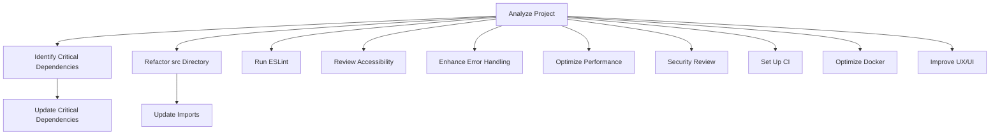

# Refactoring Plan for ConcertJournal Frontend

## Overview
This document outlines the plan to refactor and improve the ConcertJournal frontend project.

## What is Good:
1. **Modern Tech Stack**: The project uses modern technologies like React, TypeScript, Vite, Material-UI, and React Query.
2. **Lazy Loading**: Components are lazily loaded, which improves performance.
3. **Routing**: React Router is used effectively for navigation.
4. **State Management**: Contexts (`AuthContext` and `ConfigContext`) are used for managing global state.
5. **Testing**: Unit tests are set up using Vitest.
6. **Documentation**: The `README.md` provides clear setup instructions and describes the features and technologies used.

## Areas for Improvement:
1. **Version Compatibility**: Some dependencies are outdated (e.g., `react-query` v3, `vite` v6).
2. **Code Organization**: The `src` directory contains a mix of components, hooks, contexts, and utilities. Consider organizing them into subdirectories for better clarity.
3. **Code Quality**: Run ESLint to identify and fix code quality issues.
4. **Accessibility**: Ensure that the application is accessible and follows best practices for accessibility.
5. **Error Handling**: Improve error handling in API calls and other asynchronous operations.
6. **Performance Optimization**: Consider additional performance optimizations beyond lazy loading, such as code splitting and memoization.
7. **Security**: Review security practices, especially around authentication and environment variables.
8. **Continuous Integration**: Implement continuous integration (CI) to automate testing and deployment.
9. **Dockerization**: Ensure Docker configurations are optimal for development and production environments.
10. **User Experience**: Enhance the user experience by improving UI/UX design and usability.

## Plan:
1. **Identify Critical Dependencies**: Determine which dependencies are critical and need updating.
2. **Update Critical Dependencies**: Upgrade identified critical packages.
3. **Refactor the `src` Directory**: Move files to their new locations according to the proposed structure.
4. **Update Imports**: Update all import statements to reflect the new directory structure.
5. **Run ESLint**: Identify and fix code quality issues.
6. **Review Accessibility**: Ensure the application meets accessibility standards.
7. **Enhance Error Handling**: Improve error handling in API calls and other asynchronous operations.
8. **Optimize Performance**: Implement additional performance optimizations.
9. **Security Review**: Review and enhance security practices.
10. **Set Up CI**: Implement continuous integration.
11. **Optimize Docker**: Ensure Docker configurations are optimal.
12. **Improve UX/UI**: Enhance the user experience.

### Mermaid Diagram:


### Proposed Directory Structure:
```
src/
├── components/
│   ├── authenticatedPage/
│   │   └── AuthenticatedPage.tsx
│   ├── entryForms/
│   │   ├── EditEntryFormPage.tsx
│   │   ├── EntryForm.tsx
│   │   └── NewDataEntryPage.tsx
│   ├── journal/
│   │   ├── DataCollector.tsx
│   │   ├── DataTable.tsx
│   │   ├── Journal.tsx
│   │   ├── SortForm.tsx
│   │   └── SwipeableListItem.tsx
│   ├── navbar/
│   │   └── Navbar.tsx
│   ├── signIn/
│   │   ├── Content.tsx
│   │   ├── ForgotPassword.tsx
│   │   ├── signUp.tsx
│   │   ├── SignInCard.tsx
│   │   ├── SignInSide.tsx
│   │   └── SignUpSide.tsx
│   └── utilities/
│       ├── AddButton.tsx
│       ├── LoadingIndicator.tsx
│       ├── RatingStars.tsx
│       ├── StatCard.tsx
│       └── ToggleColorMode.tsx
├── contexts/
│   ├── AuthContext.tsx
│   └── ConfigContext.tsx
├── hooks/
│   ├── useAuth.tsx
│   └── useEvents.tsx
├── theme/
│   ├── DefaultLayout.tsx
│   ├── getTheme.tsx
│   └── useTheme.tsx
├── utils/
│   ├── calculateStatistics.ts
│   └── SortData.tsx
├── api/
│   ├── apiAuth.tsx
│   ├── apiClient.tsx
│   ├── apiEvents.tsx
│   └── musicBrainzApi.tsx
├── App.css
├── App.test.tsx
├── App.tsx
├── index.css
├── index.tsx
└── logo.svg